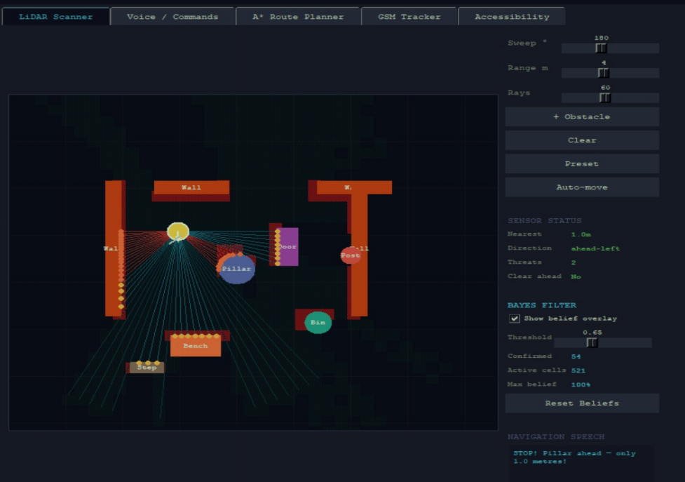
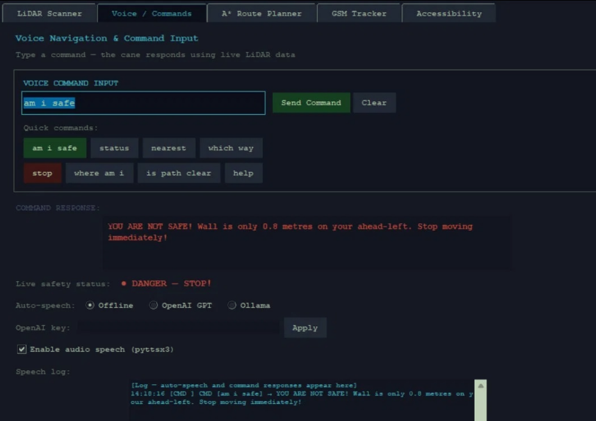
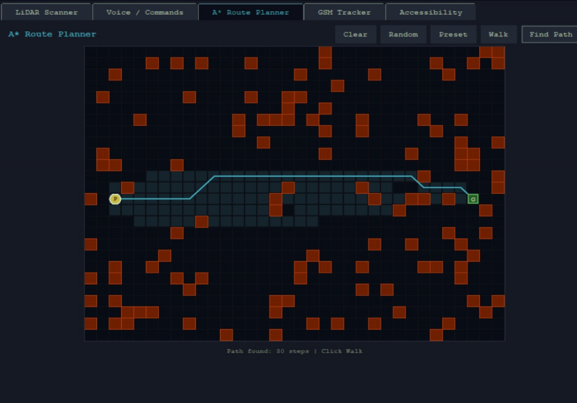
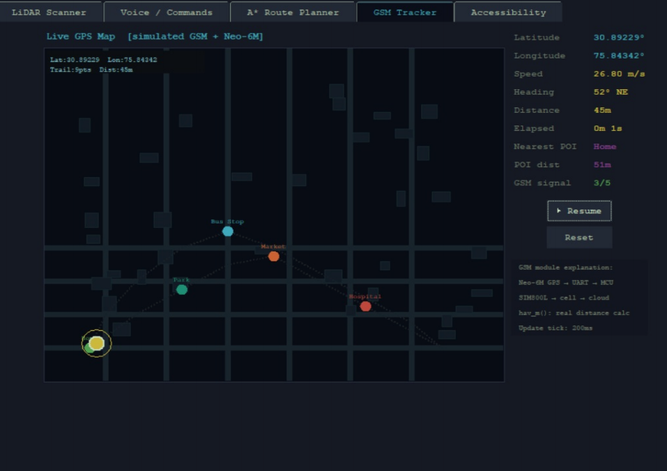

# Smart LiDAR & Bayesian Filter Based Walking Stick 🦯

A real-time **navigation-assistance simulator** for the visually impaired, built in Python/Tkinter. It models a smart walking stick that fuses **2D LiDAR obstacle detection**, a **Binary Bayes Filter** occupancy map, **A\*** pathfinding, **GPS/GSM** tracking, and a **voice command** interface — all in one integrated, multi-tab desktop app.

> This is a **software simulation** of the complete system. Every algorithm (ray-casting, log-odds occupancy mapping, A\*, Haversine distance, command parsing) runs in real time. The corresponding hardware architecture (RPLiDAR A1M8, Raspberry Pi 4B, NEO-6M GPS, SIM800L GSM) is fully specified for a future physical build.

---

## 📸 Screenshots

> Add your screenshots to a `screenshots/` folder and they'll show up here. You can grab them by running the app, or export the figures from the project report.

| LiDAR Scanner | Voice Commands |
|---|---|
|  |  |

| A\* Route Planner | GPS / GSM Tracker |
|---|---|
|  |  |

---

## ✨ Features

The app is organised into five tabs, each demonstrating one module:

1. **LiDAR Scanner** — Real-time 2D ray-cast scanner (configurable sweep angle, range, and ray count). Detects obstacles, reports nearest distance and direction, and classifies the scene as **SAFE / CAUTION / DANGER**.
2. **Voice / Commands** — Type natural-language queries and get spoken + on-screen responses driven by live sensor data. Supports offline TTS (`pyttsx3`) and an optional OpenAI backend.
3. **A\* Route Planner** — Interactive grid where you draw walls, set a goal, and watch A\* compute and animate an optimal collision-free path.
4. **GSM Tracker** — Simulated live GPS map with movement trail, speed, heading, distance travelled, and nearest point-of-interest, using the Haversine formula.
5. **Accessibility** — Audio, haptic, and display settings, plus a hardware mapping guide.

### Voice commands

Type any of these in the Voice tab and press Enter:

| Command | Response |
|---|---|
| `am i safe` | Checks live LiDAR and reports safe / danger |
| `status` | Full obstacle report |
| `nearest` | Closest obstacle name + distance |
| `which way` | Best direction to move |
| `is path clear` | Yes/no path check |
| `where am i` | GPS coordinates from the tracker |
| `stop` | Stop confirmation |
| `help` | Lists all commands |

---

## 🛠️ Tech Stack

- **Language:** Python 3.10+
- **GUI:** Tkinter (standard library)
- **Text-to-speech:** pyttsx3 (offline) — *optional*
- **LLM responses:** OpenAI API — *optional*
- **Core libraries:** `math`, `heapq`, `threading`, `queue` (all standard library)

---

## 🚀 Getting Started

### Prerequisites
- Python 3.10 or newer
- Tkinter (bundled with most Python installs; on Debian/Ubuntu: `sudo apt install python3-tk`)

### Installation

```bash
# Clone the repository
git clone https://github.com/Pranav9441/LiDAR-and-bayesian-filter-based-smart-walking-stick.git
cd LiDAR-and-bayesian-filter-based-smart-walking-stick

# (Optional) install the optional dependencies for audio + LLM responses
pip install -r requirements.txt

# Run the app
python smart_cane_v2.py
```

The app runs fine **without** the optional dependencies — voice output simply prints to the console instead of speaking, and the OpenAI mode is disabled.

> Press **Q** at any time to quit.

---

## 🧠 How It Works

A few of the algorithms under the hood:

- **LiDAR ray-casting** — Each ray is tested against every obstacle (line-segment and circle intersection math) to find the nearest hit, giving distance and direction per ray.
- **Binary Bayes Filter** — The occupancy grid stores each cell as a log-odds value, updated with an inverse sensor model (`+0.9` when detected, `−0.4` for free space). Cells above a `0.65` probability threshold are confirmed as obstacles, making detection robust to noise.
- **A\* pathfinding** — Grid search with an **octile distance** heuristic (diagonal moves cost `1.414`) and a min-heap open set, reconstructing the path via parent pointers.
- **Haversine distance** — Great-circle distance between GPS coordinates for accurate trail length and POI proximity.

---

## 📂 Project Structure

```
LiDAR-and-bayesian-filter-based-smart-walking-stick/
├── smart_cane_v2.py        # Main application (all five modules)
├── requirements.txt        # Optional dependencies
├── README.md
├── .gitignore
├── docs/
│   └── project_report.pdf  # Full technical report
└── screenshots/            # App screenshots used in this README
```

---

## 🔌 Hardware Architecture (for future physical build)

| Component | Role |
|---|---|
| RPLiDAR A1M8 | 2D LiDAR sensor (0.15–12 m range) |
| Raspberry Pi 4B | Primary processing unit |
| Arduino Mega 2560 | Low-level peripheral controller (UART, PWM, I2C) |
| NEO-6M GPS | Location tracking (NMEA 0183) |
| SIM800L GSM | Cellular data / emergency location |
| Coin vibration motor | Haptic feedback |
| PAM8403 + speaker | Audio / TTS output |

---

## 🗺️ Future Scope

- SLAM integration (ROS 2 + Gazebo) for GPS-free indoor mapping
- Monocular depth estimation (OpenCV / MiDaS) to detect glass and transparent obstacles
- IMU-based fall detection with automatic emergency alerts
- Migration to Raspberry Pi Zero 2W / ESP32-S3 for a lighter, cane-mounted device
